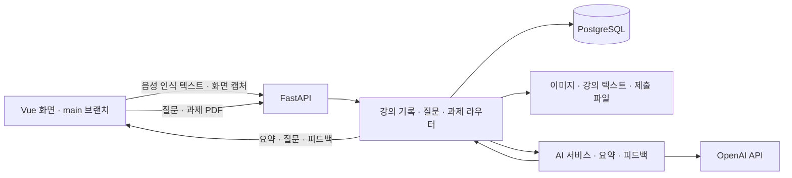

# Project 2025 · 교수·학습 지원 시스템 — Backend

강의 중 질문 생성부터 수업 후 복습 자료, 학생 Q&A, 과제 피드백까지 연결하는 **생성형 AI 기반 교수·학습 지원 시스템의 FastAPI 백엔드**입니다. 브라우저에서 전달한 강의 발화와 화면을 저장하고, 학습자가 다시 확인할 수 있는 요약·질문·피드백으로 구성합니다.

이 저장소는 프론트엔드와 백엔드를 서로 다른 브랜치로 관리합니다.

| 브랜치 | 구성 | 바로가기 |
|---|---|---|
| `main` | Vue 기반 교수자·학습자 화면, 브라우저 음성 인식·화면 캡처 | [프론트엔드](https://github.com/YoonDaeSung-01/project2025/tree/main) |
| **`backend`** | **FastAPI API, PostgreSQL 모델, AI 연동** | **현재 문서** |

> 이 문서는 `backend`의 기존 구현을 코드 기준으로 정리한 개발 기록입니다. 기준 코드: [`b78be75`](https://github.com/YoonDaeSung-01/project2025/tree/b78be75996ef68080478b346cd05d951b99ad051). 현재 환경에서의 전체 실행·배포 검증은 수행하지 않았으며, 재실행 시 확인할 사항은 아래에 명시했습니다.

## 어떤 문제를 다루나요?

수업 중 질문을 떠올리기 어렵거나, 강의가 끝난 뒤 발화와 화면을 함께 복습하기 어렵고, 과제에 대한 피드백을 기다려야 하는 상황을 다룹니다.

| 시점 | 제공하는 기능 | 백엔드 처리 |
|---|---|---|
| 수업 중 | 강의 내용에 따른 예상 질문과 학생 질문 모으기 | 텍스트 누적, AI 질문 생성, 질문·좋아요 저장 |
| 수업 중·후 | 강의 화면과 발화 기록 | 이미지 파일 저장, 강의별 텍스트 로그와 DB 기록 |
| 수업 후 | 주제별 복습 자료 | 강의 요약 생성, 관련 발화에 해당하는 화면 선택, 요약 저장·조회 |
| 개별 학습 | AI 조교 질의응답 | 개념·문법·해결 방향 중심의 응답 요청, 사용자별 Q&A 이력 저장 |
| 과제 학습 | AI 예비 피드백과 교수자 피드백 | 제출 PDF 텍스트 추출, AI 피드백 생성, 교수자 피드백 별도 저장 |

## 백엔드 개발 기여

윤대성이 백엔드 개발을 주도한 팀 프로젝트입니다. 기능을 확인할 수 있는 주요 코드 진입점은 다음과 같습니다.

| 영역 | 확인할 구현 |
|---|---|
| API·DB 구성 | [앱과 라우터 등록](app/main.py), [비동기 DB 세션](app/database.py), [모델과 관계](app/models.py) |
| 강의 기록·복습 | [스냅샷 저장과 강의 요약](app/routes/snapshots.py), [주제별 요약·화면 선택](app/utils/gpt.py) |
| 질문 생성·참여 | [텍스트 누적과 질문·좋아요 API](app/routes/vad.py), [예상 질문 생성](app/services/gpt.py) |
| AI 조교 | [질의응답 API와 사용자 이력 저장](app/routes/ask_assistant.py), [AI 조교 서비스](app/services/assistant.py) |
| 과제 피드백 | [과제·제출·피드백 API](app/routes/assignment.py), [AI 피드백 생성](app/utils/gpt_feedback.py) |

기준 커밋까지의 브랜치 이력은 총 387개이며, 작성자명 `YoonDaesung`으로 기록된 커밋은 292개입니다. 이는 **Git 작성자 기록**이며, 기능별 기여율이나 팀 전체 기여율을 뜻하지 않습니다. [백엔드 커밋 이력](https://github.com/YoonDaeSung-01/project2025/commits/backend/)

## 시스템 흐름



### 코드에서 확인할 설계 포인트

- **강의 발화와 화면 연결:** 시간·강의 ID·텍스트·이미지 경로를 함께 저장합니다. `is_image`로 텍스트만 있는 기록과 이미지가 있는 기록을 구분합니다.
- **주제와 관련된 복습 화면 선택:** 전체 발화에서 주제별 요약을 만들고, 각 스냅샷의 발화를 GPT에 전달해 주제와 관련된 화면을 최대 2개 선택합니다. 이미 선택한 이미지 경로를 추적해 주제 간 중복 사용을 줄입니다.
- **학습을 돕는 Q&A:** AI 조교에 정답 코드보다 핵심 개념·관련 문법·해결 방향을 설명하도록 요청합니다. 이는 프롬프트 수준의 동작 지침이며 응답 준수를 보장하는 별도 검증기는 아닙니다.
- **두 종류의 과제 피드백 보존:** AI가 생성한 피드백과 교수자가 작성한 피드백을 서로 다른 필드와 생성 시각으로 저장합니다.

현재 `main`의 [RecordingManager.js](https://github.com/YoonDaeSung-01/project2025/blob/main/src/managers/RecordingManager.js)는 브라우저 `SpeechRecognition`을 사용합니다. 백엔드의 `vad.py`는 이름과 달리 **이미 변환된 텍스트를 받는 라우터**입니다. Whisper·임베딩 관련 의존성이나 함수가 남아 있지만, 현재 등록된 강의 요약 경로를 Whisper STT 또는 임베딩 기반 이미지 검증으로 설명하지 않습니다.

## 기술 구성

| 영역 | 코드에 사용된 기술 |
|---|---|
| API | Python, FastAPI, Pydantic, Uvicorn |
| DB | PostgreSQL, SQLAlchemy AsyncSession, asyncpg |
| AI 연동 | OpenAI SDK·HTTPX, Chat Completions, 기존 Assistants API |
| 인증 | JWT, python-jose, Passlib의 bcrypt 해시 |
| 파일 처리 | PyMuPDF, aiofiles, Base64 이미지 저장 |
| 스키마 관리 | SQLAlchemy 모델, Alembic 마이그레이션 파일 |

[requirements.txt](requirements.txt)에는 이전 실험용 패키지도 포함돼 있습니다. 설치 목록과 현재 API에서 실제 호출하는 기능을 구분해 확인해야 합니다.

## 주요 API

아래 경로는 `app/main.py`의 라우터 접두사를 포함한 실제 등록 경로입니다.

| 기능 | 메서드·경로 | 설명 |
|---|---|---|
| 서버 응답 | `GET /ping` | 프로세스 응답 확인. DB·AI의 종합 상태 검사는 아님 |
| 로그인 | `POST /login` | 폼 입력으로 JWT 발급 |
| AI 조교 | `POST /ask_assistant` | 질문 폼 처리와 로그인 사용자 이력 저장 |
| 내 Q&A | `GET /chat_history/me` | 사용자별 질문·답변 조회 |
| 강의 세션 | `POST /snapshots/lectures` | 캡처 기록을 위한 강의 ID 생성 |
| 강의 기록 | `POST /snapshots/snapshots` | `lecture_id`와 발화·이미지 저장 |
| 핵심 정리 | `GET /snapshots/generate_markdown_summary` | 강의 텍스트에서 핵심 개념 요약 |
| 복습 자료 생성 | `POST /snapshots/lecture_summary` | 주제별 요약과 관련 화면 저장 |
| 복습 자료 조회 | `GET /snapshots/lecture_summary` | 저장된 주제별 요약 조회 |
| 수업 텍스트 | `POST /upload_text_chunk` | 질문 생성용 텍스트 누적 |
| 예상 질문 | `POST /trigger_question_generation` | 누적 내용으로 질문 생성·저장 |
| 질문 참여 | `POST /student_question`, `PATCH /question/{q_id}/like` | 학생 질문 등록과 좋아요 |
| 과제 생성 | `POST /assignments/create` | 교수자 과제 등록 |
| 과제 제출 | `POST /assignments/{assignment_id}/submit` | PDF 제출과 AI 피드백 |
| 교수자 피드백 | `POST /assignments/{assignment_id}/student/{student_id}/professor-feedback` | 교수자 피드백 저장 |

서버 기동 후 `/docs`에서 요청 필드와 응답 스키마를 확인할 수 있습니다. `/snapshots/snapshots`는 현재 코드의 실제 경로이므로 문서에서 임의로 줄이지 않았습니다.

## 저장소 구조

```text
app/
├── main.py              # 앱 생성, CORS, 라우터·정적 파일 등록
├── auth.py              # 로그인, JWT, 사용자·역할 확인
├── config.py            # AI 설정값
├── database.py          # PostgreSQL 비동기 엔진과 세션
├── models.py            # 사용자·강의·질문·요약·과제 모델
├── init_db.py           # 모델 기준 테이블 생성 진입점
├── routes/              # 강의, 스냅샷, 질문, 과제 API
├── services/            # AI 조교·예상 질문·임베딩 함수
└── utils/               # 요약·화면 선택·과제 피드백
alembic/                 # 기존 DB 마이그레이션 파일
static/                  # HTTP로 제공하는 이미지
uploads/                 # 기존 자료와 과제 제출 파일
requirements.txt
```

강의 텍스트 로그는 실행 중 루트의 `data/`에 생성됩니다. `static/`, `data/`, `uploads/`는 실행 서버에 저장되는 파일이므로 운영 시 DB와 별도로 보존 방식을 정해야 합니다.

## 실행 준비와 현재 호환성

### 먼저 확인할 사항

**AI 조교·예상 질문·주제별 전체 요약은 기존 Assistants API에 의존합니다.** OpenAI 공식 문서는 이 API의 종료일을 2026-08-26로 안내합니다. 따라서 새 환경에서 해당 기능을 재현하려면 API 전환과 검증이 먼저 필요합니다. 아래는 기존 구성과 실행 진입점 기록이며, 모든 기능이 지금 바로 실행된다는 보장은 아닙니다. [OpenAI 공식 안내](https://platform.openai.com/docs/assistants/deep-dive)

### 코드 내려받기와 의존성 준비

```bash
git clone --branch backend https://github.com/YoonDaeSung-01/project2025.git project2025-backend
cd project2025-backend
python -m venv venv
# Windows PowerShell: .\venv\Scripts\Activate.ps1
# macOS / Linux: source venv/bin/activate
python -m pip install -r requirements.txt
```

Python 버전 전체와 대부분의 패키지 버전은 고정되어 있지 않습니다. 설치 과정에는 PyTorch와 Whisper 등도 포함됩니다. Python·패키지 호환성과 bcrypt 백엔드 설치 여부를 실행 환경에 맞춰 확인해야 합니다.

### 환경 설정

아래 값은 비밀값을 소스에 쓰지 않고 서버 프로세스 환경변수로 전달합니다.

| 변수 | 용도 |
|---|---|
| `DB_HOST`, `DB_PORT` | PostgreSQL 주소와 포트 |
| `DB_NAME`, `DB_USER`, `DB_PASSWORD` | 데이터베이스 이름과 접속 계정 |
| `SECRET_KEY` | JWT 서명용 별도 비밀값 |
| `BASE_URL` | 이미지 링크를 구성할 백엔드 주소. 로컬 예: `http://127.0.0.1:8000` |
| `OPENAI_API_KEY` | AI 호출 인증 |
| `OPENAI_ASSISTANT_ID` | 기존 AI 조교 설정 식별자 |
| `OPENAI_QUESTION_ASSISTANT_ID` | 기존 예상 질문 생성 설정 식별자 |
| `OPENAI_SUMMARY_ASSISTANT_ID` | 기존 주제별 요약 설정 식별자 |

마지막 세 값은 과거 Assistant 구성에 의존하며, 식별자만 입력하는 것으로 API 종료 문제가 해결되지 않습니다. 강의자료·도구 설정도 기존 외부 구성에 의존합니다. `.env`를 사용하는 경우에는 `snapshots.py`의 Pydantic Settings가 다른 모듈용 추가 키를 허용하는지 먼저 확인해야 합니다.

### 서버 진입점

전용 개발 PostgreSQL DB와 설정을 준비한 뒤 저장소 루트에서 실행합니다.

```bash
python -m uvicorn app.main:app --host 127.0.0.1 --port 8000 --reload
```

- 앱은 시작 시 모델 기준으로 테이블 생성을 시도합니다. 기존 테이블의 컬럼을 자동으로 이관하는 기능은 아닙니다.
- 현재 CORS 허용 주소와 프론트엔드 API 주소는 기존 Render 배포를 기준으로 고정돼 있어, 로컬 화면 연동 시 양쪽 설정 확인이 필요합니다.
- 기존 Alembic 파일에는 연속된 두 리비전이 같은 테이블을 생성하는 내용이 있습니다. `alembic upgrade head`를 검증된 초기화 절차로 사용하지 않습니다.

## 알려진 제약과 후속 개선

- **외부 API 호환성:** Assistants 기반 경로 전환과 기존 강의자료·프롬프트 설정 재구성이 필요합니다.
- **운영 권한:** 일부 API의 접근 제어가 충분하지 않습니다. 특히 관리자 권한 부여 경로의 인증·인가를 보완하기 전에는 공개 운영용으로 사용하지 않아야 합니다.
- **동시 수업:** 질문 생성용 `text_buffer`는 프로세스 전역 메모리입니다. 수업별 분리와 다중 워커 지원이 필요합니다.
- **과제 제출 조건:** 현재 코드는 마감 전 제출을 거절하도록 작성돼 있습니다. 의도한 과제 정책과 대조해 수정·검증할 항목입니다.
- **재현성:** 의존성 버전 고정, DB 초기화 절차 정리, 기능별 자동 검증이 후속 과제입니다. 이 문서에는 검증하지 않은 정확도·응답시간 수치를 싣지 않았습니다.

현재 문서는 브랜치 구조와 구현을 소개하기 위한 정리이며, 위 항목의 코드 수정이나 서비스 재배포를 포함하지 않습니다.
